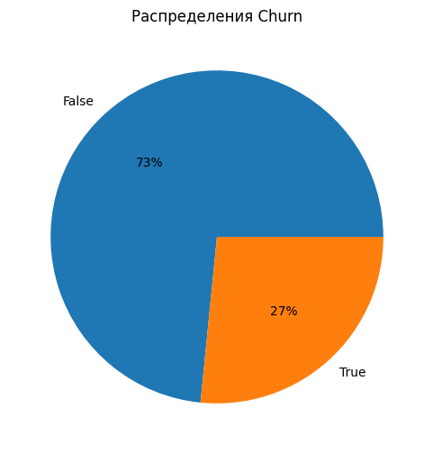
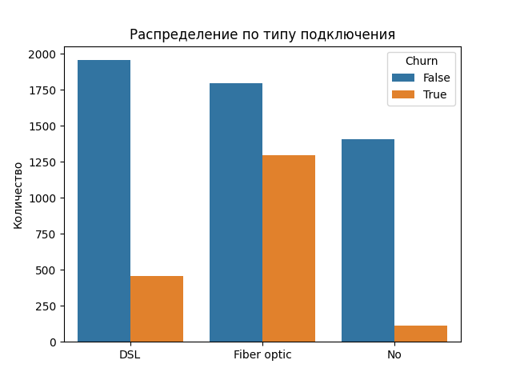
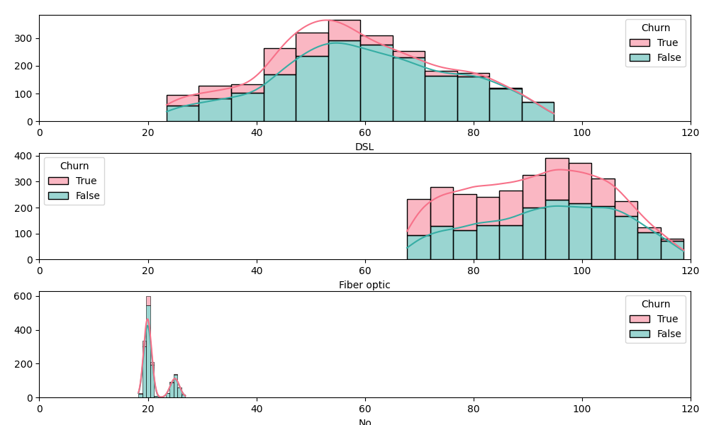
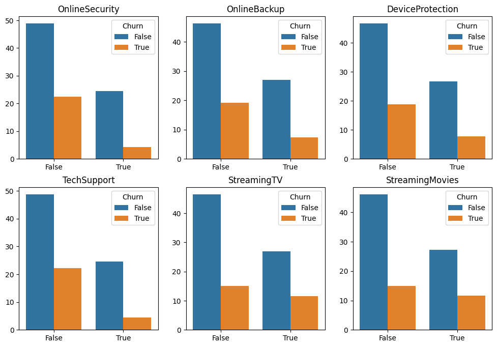
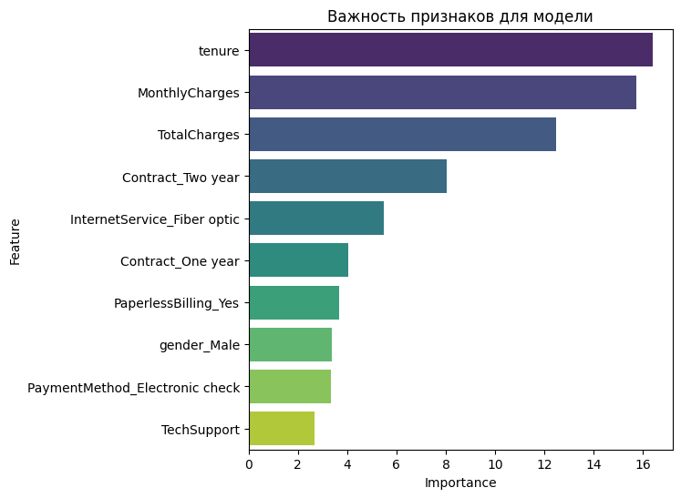

# Анализ оттока клиентов

## Описание проекта  
Цель проекта — выявить ключевые факторы, влияющие на отток клиентов, и предложить стратегии для его снижения. В ходе анализа использовались методы обработки данных, разведочного анализа (EDA) и построения моделей машинного обучения.

- **Данные:** [Kaggle](https://www.kaggle.com/datasets/tarekmuhammed/telecom-customers)  
- **Полная версия** [Jupyter Notebook](ChurnPredict.ipynb)  

## Этапы работы  

### 1. Предобработка данных  
- Очистка данных: обработка пропусков, дубликатов и выбросов.  
- Кодирование категориальных переменных.  
- Преобразование `TotalCharges` в числовой формат.  
- Масштабирование числовых признаков.  

### 2. Разведочный анализ (EDA)  
- **Распределение клиентов по оттоку:**  
  - Визуализация распределения `Churn` среди клиентов
    

- **Факторы, влияющие на отток:**  
  - **Тип подключения:** Клиенты с `Fiber optic` в группе повышенного риска
    

  - **Ежемесячные платежи (`MonthlyCharges`)**: Внутри одной категории услуг более дорогие тарифы коррелируют с меньшим оттоком 
    

 
  - **Дополнительные услуги:** Клиенты, использующие `OnlineSecurity`, `TechSupport`, менее склонны к уходу
    

 
  - **Длительность сотрудничества (`tenure`)**: Чем дольше клиент остается, тем ниже вероятность оттока
- **Корреляционный анализ:**  
  - Построение матрицы корреляций
  - Выявление мультиколлинеарных признаков  

### 3. Построение модели предсказания оттока  
- Разделение данных на train/test.  
- Балансировка классов с помощью oversampling.  
- Обучение и сравнение моделей:  
  - **CatBoostClassifier (0.794) — лучший результат**
  - **XGBoost (0.758)**.  
  - **Sklearn (0.734)**.
- Оценка важности признаков:
  

### 4. Выводы и рекомендации  
- Определены ключевые факторы, влияющие на отток.  
- Использование дополнительных услуг повышает удержание клиентов.  
- Клиенты с `Fiber optic` требуют дополнительного внимания.  
- Разработана модель с точностью **0.794**, помогающая прогнозировать отток.  

## Используемые инструменты  
- **Язык программирования**: Python  
- **Библиотеки**: pandas, numpy, matplotlib, seaborn, scikit-learn, catboost, xgboost  

## Вывод  
Разработанный подход позволяет предсказывать отток клиентов и понимать его причины, что дает возможность бизнесу принимать более эффективные решения по удержанию клиентов.

